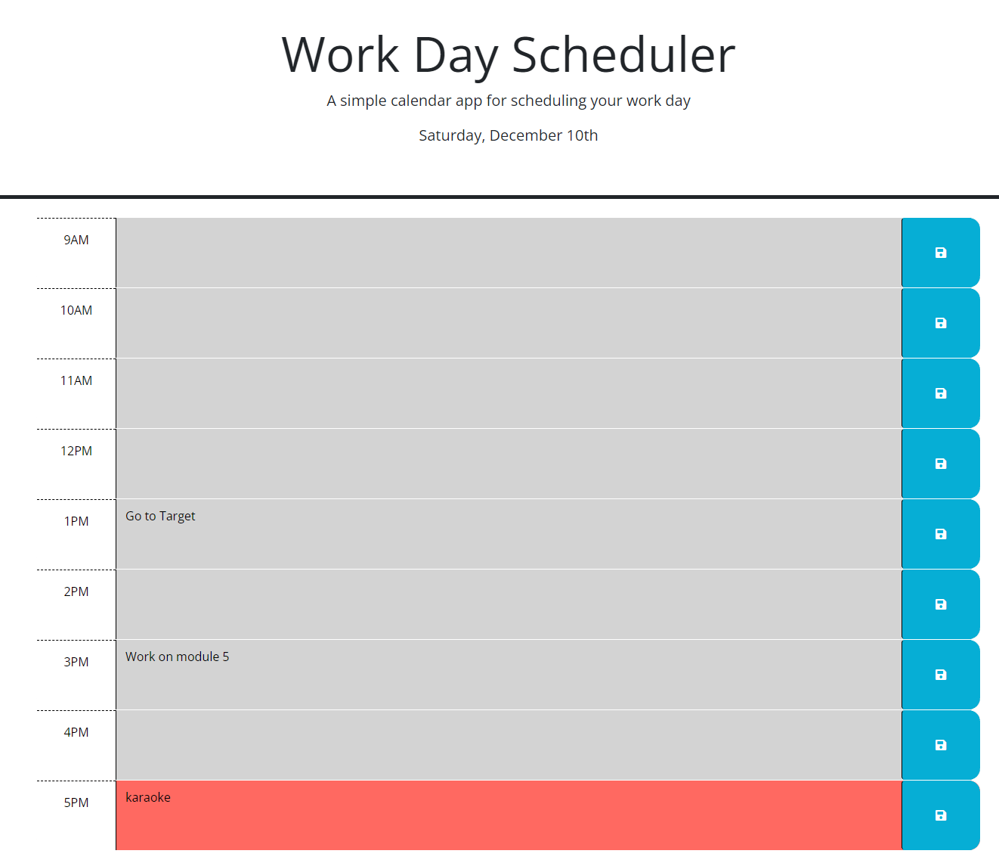

## Table of contents
​
- [Overview](#overview)
  - [The challenge](#the-challenge)
  - [Screenshot](#screenshot)
  - [Links](#links)
- [My process](#my-process)
  - [Built with](#built-with)
  - [What I learned](#what-i-learned)
  - [Continued development](#continued-development)
  - [Useful resources](#useful-resources)
- [Author](#author)

​
## Overview
​
### The challenge
​
Users should be able to:
​
- AS AN employee with a busy schedule
- I WANT to add important events to a daily planner
- SO THAT I can manage my time effectively


Acceptance Criteria

- GIVEN I am using a daily planner to create a schedule
- WHEN I open the planner
- THEN the current day is displayed at the top of the calendar
- WHEN I scroll down
- THEN I am presented with timeblocks for standard business hours
- WHEN I view the timeblocks for that day
- THEN each timeblock is color coded to indicate whether it is in the past, present, or future
- WHEN I click into a timeblock
- THEN I can enter an event
- WHEN I click the save button for that timeblock
- THEN the text for that event is saved in local storage
- WHEN I refresh the page
- THEN the saved events persist

​
### Screenshot
​

​

​
### Links
​
- Solution URL: [https://github.com/AveryCaldwell/work-Day-Scheduler](https://github.com/AveryCaldwell/work-Day-Scheduler)
- Live Site URL: [https://averycaldwell.github.io/work-Day-Scheduler/](https://averycaldwell.github.io/work-Day-Scheduler/)
​
## My process
​
### Built with
​
- Semantic HTML5 markup
- CSS custom properties
- JavaScript
- Day.js
- jQuery
​
​
​
### What I learned
​
- While working on this project, I learned how to use `switch` to add ordinals such as "st" and "nd".
- In regard to local storage, I learned how to load data by retrieving saved user input.
- This is the first time I have used `day.js`and it made setting current hours, day, and date much easier.
​
​
```js
  let ordinal;
  switch (now.format("D")) {
    case "1":
      ordinal = "st";
      break;
    case "2":
      ordinal = "nd";
      break;
    case "3":
      ordinal = "rd";
      break;
    default:
      ordinal = "th";
      break;
  }
```
​
```js
const loadData = function (hour) {
  let hourEl = "#hour-" + hour;
  const textEl = $(hourEl).children("textarea")[0];
  textEl.value = localStorage.getItem("hour-" + hour);}
```
​
```js
  $("#currentDay").html(
    now.format("dddd") +
      ", " +
      now.format("MMMM") +
      " " +
      now.format("D") +
      ordinal
  )
```
​<br>

### Continued development

​I want to further my understanding of `localStorage` and how to get and set data. I would also like to better understand `switch` because the statement allowed me to change the header using shorter, concise code.

<br>

### Useful resources
​
- [Switch](https://developer.mozilla.org/en-US/docs/Web/JavaScript/Reference/Statements/switch) - This helped me with comparing values. I really liked how much time it saved and allowed me to edit text without changing the html.
- [Window.localStorage](https://developer.mozilla.org/en-US/docs/Web/API/Window/localStorage) - This is an amazing article which helped me better understand localStorage. I'd recommend it to anyone still learning this concept.
​

​<br>

## Author
Avery Caldwell
- GitHub - [Avery Caldwell](https://github.com/AveryCaldwell)
​
​<br>
